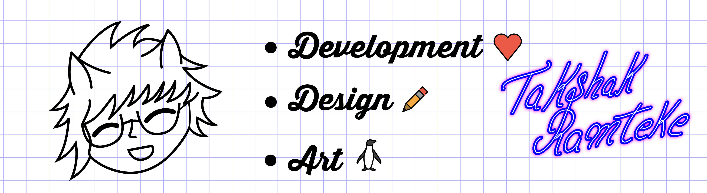

## Hey There :wave:, I'm Takshak Ramteke

**Here's a litle about me**  
:person_curly_hair: I'm A Fun Loving, Enthusiastic & Passionate Developer  
:factory_worker: Currently I work as a freelance fullstack developer and designer  
:student: Also i am currently pursuing my bachelors in Computer science and engineerig (senior year)  

but it's not like i do tech all the time

**Other than tech**  
:art: I sometimes do sketches of my favourite Anime / Manga character's  
:book: I really love reading manga (berserk, bleach 💜) &  
:kr: Webtoons and Anime [🤷‍♂️ obviously btw Evangelion 💜]  

### 🤙 Connect with me:

 

### 📈 And ofcourse Some Stats

    
    

*BTW Here's [my resume](https://drive.google.com/file/d/1TB2LpyWScNBK34Vz4w1FFhVWBpFu4Pve/view?usp=sharing)*
